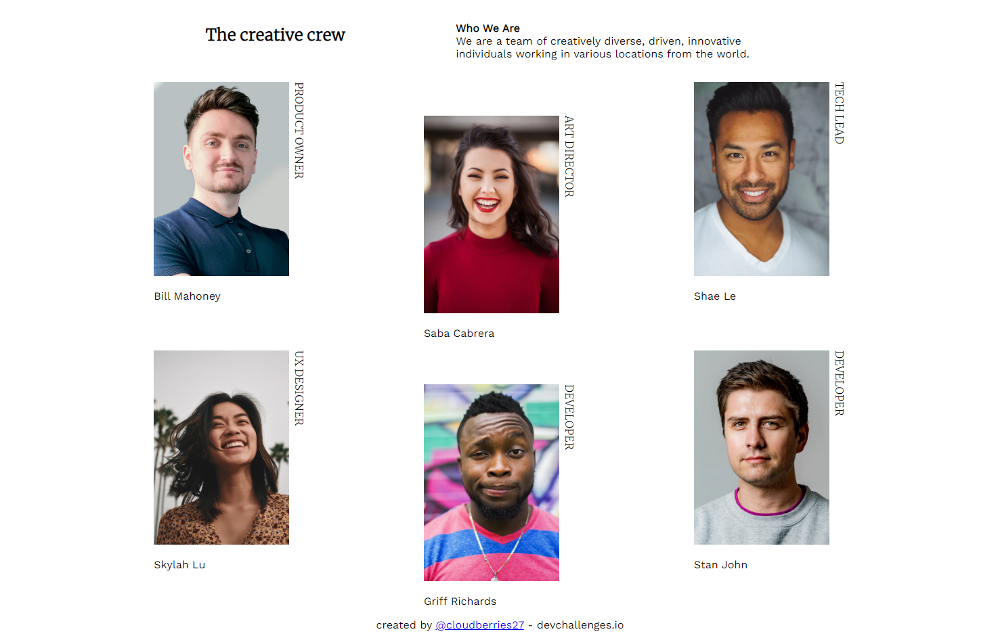

<!-- Please update value in the {}  -->

<h1 align="center">My Team Page</h1>

   Solution for a challenge from  <a href="http://devchallenges.io" target="_blank">Devchallenges.io</a>.

  <h3>
    <a href="https://cloudberries27.github.io/DevChallenge-TeamPage/">
      Demo
    </a>
     | 
    <a href="https://github.com/cloudberries27/DevChallenge-TeamPage">
      Solution
    </a>
     | 
    <a href="https://devchallenges.io/challenges/hhmesazsqgKXrTkYkt0U">
      Challenge
    </a>
  </h3>

<!-- TABLE OF CONTENTS -->

## Table of Contents

- [Overview](#overview)
  - [Built With](#built-with)
- [Features](#features)
- [Contact](#contact)
- [Acknowledgements](#acknowledgements)

<!-- OVERVIEW -->

## Overview

- The demo is above ^^
- This took me around 1 hour to do 
- Only really looked up flex box and grid just to see which is better for this kind of display.
- More wisdom huh? Umm still don't got any dude. Here's an inspirational quote though: "Keep Moving Forward" - Walt Disney

### Built With

<!-- This section should list any major frameworks that you built your project using. Here are a few examples.-->

- HTML
- CSS

## Features

<!-- List the features of your application or follow the template. Don't share the figma file here :) -->

This page was created as a submission to a [DevChallenges](https://devchallenges.io/challenges) challenge. The [challenge](https://devchallenges.io/challenges/wBunSb7FPrIepJZAg0sY) was to build an application to complete the given user stories.

## Acknowledgements

<!-- This section should list any articles or add-ons/plugins that helps you to complete the project. This is optional but it will help you in the future. For example -->

- Another One: Shout out to my dad who taught me HTML/CSS
- Learn [Flex Box](https://css-tricks.com/snippets/css/a-guide-to-flexbox/)
- Learn [Grid](https://css-tricks.com/snippets/css/complete-guide-grid/)

## Contact

- Website [fanamera.com](https://fanamera.com)
- GitHub [@cloudberries27](https://github.com/cloudberries27)
- Codepen [@cloudberries27](https://codepen.io/cloudberries27)